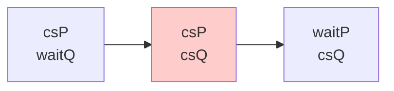
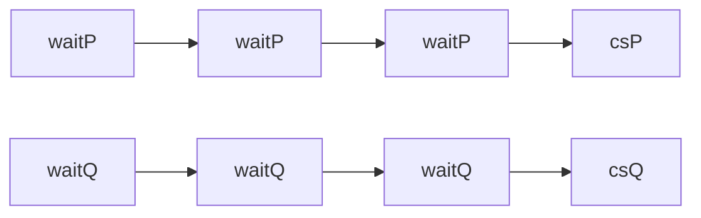
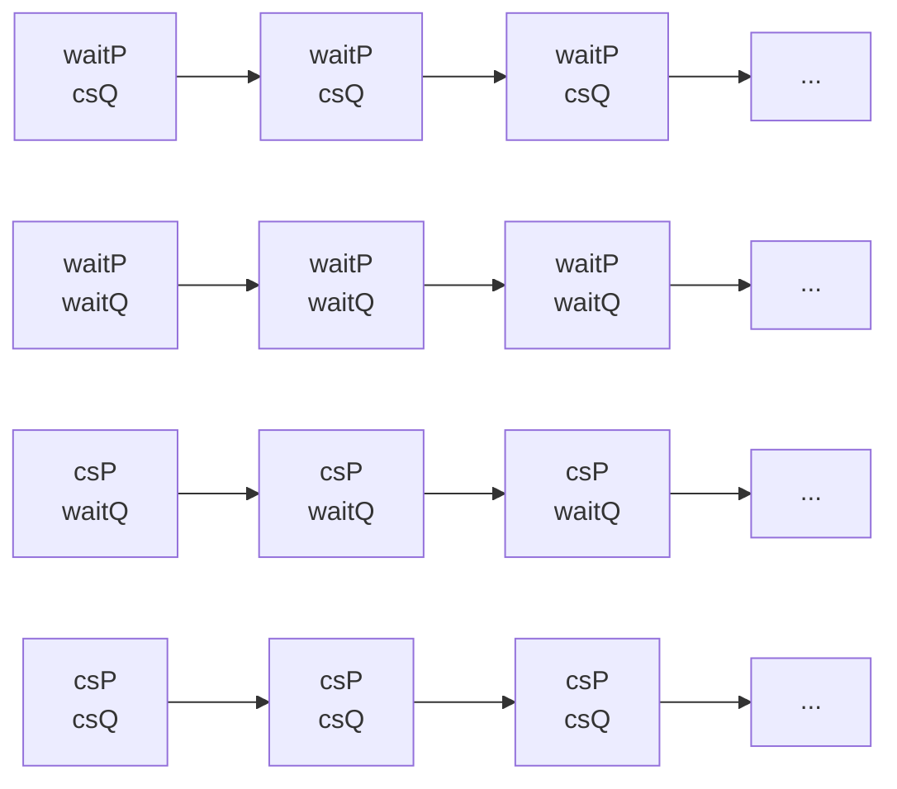
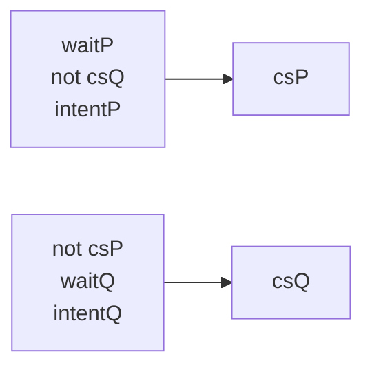
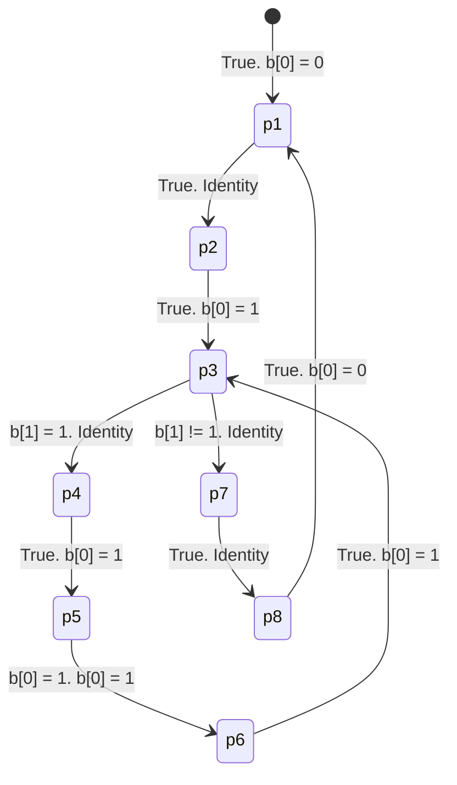
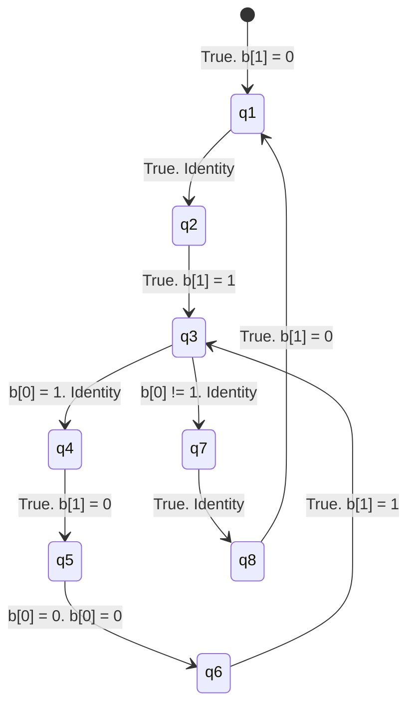

# ASS0 - Dan Nguyen (z5206032)

## Part 1

Let:
- $\text{csP}$ be the event where $P$ enters its critical section.
- $\text{csQ}$ be the event where $Q$ enters its critical section.
- $\text{waitP}$ be the event where $P$ is waiting.
- $\text{waitQ}$ be the event where $Q$ is waiting.
- $\text{intentP}$ be $P$'s intent to enter its critical section.
- $\text{intentQ}$ be $Q$'s intent to enter its critical section.

### Mutual Exclusion

Consider the timeline where there is no mutual exclusion:


Mutual exclusion is modelled as:
$$
\text{mutexPQ} \models \Box \neg(\text{csP} \land \text{csQ}) \\
$$

The `spin` command to verify this model is:
```
spin -search -ltl mutexPQ algY.pml
```

### Eventual Entry

Consider the timelines where there is an eventual entry:


Eventual entry is modelled as:
$$
\begin{aligned}
\text{entryP} &\models \Box(\text{waitP} \implies \Diamond \text{csP}) \\
\text{entryQ} &\models \Box(\text{waitQ} \implies \Diamond \text{csQ}) \\
\end{aligned}
$$

The `spin` commands to verify these models are:
```
spin -search -a -ltl entryP algY.pml
spin -search -a -ltl entryQ algY.pml
```

### Absence of Deadlock

Consider the timelines where there is a deadlock:



Absence of deadlock is modelled as:
$$
\begin{aligned}
\text{deadlock1} &\models \Diamond\Box\neg(\text{waitP} \land \text{csQ}) \\
\text{deadlock2} &\models \Diamond\Box\neg(\text{waitP} \land \text{waitQ}) \\
\text{deadlock3} &\models \Diamond\Box\neg(\text{csP} \land \text{waitQ}) \\
\text{deadlock4} &\models \Diamond\Box\neg(\text{csP} \land \text{csQ}) \\
\end{aligned}
$$

The `spin` commands to verify these models are:
```
spin -search -ltl deadlock1 algY.pml
spin -search -ltl deadlock2 algY.pml
spin -search -ltl deadlock3 algY.pml
spin -search -ltl deadlock4 algY.pml
```

### Absence of Unncessary Delay

Consider the timelines where there are no unncessary delays:



Absence of unncessary delay is modelled as:
$$
\begin{aligned}
\text{delayP} &\models \Box((\text{waitP} \land \Box\neg\text{csQ} \land \text{intentP}) \implies \Diamond \text{csP}) \\
\text{delayQ} &\models \Box((\Box\neg\text{csP} \land \text{waitQ} \land \text{intentQ}) \implies \Diamond \text{csQ}) \\
\end{aligned}
$$

The `spin` command to verify this model is:
```
spin -search -a -ltl delayP algY.pml
spin -search -a -ltl delayQ algY.pml
```

### Conclusion

Algorithm Y is a solution to the critical section problem since no failed assertions were raised.

## Part 2

### Programs

Programs $p$ and $q$ shares a bit array, $b$, which is initialised as:
```
bit b[2] = {0, 0}
```

The program $p$ is:
```
    loop forever
p1:     non-critical section
p2:     b[0] = 1
p3:     while b[1] == 1
p4:         b[0] = 1
p5:         await (b[0] == 1)
p6:         b[0] = 1
p7:     critical section
p8:     b[0] = 0
```

The program $q$ is:
```
    loop forever
q1:     non-critical section
q2:     b[1] = 1
q3:     while b[0] == 1
q4:         b[1] = 0
q5:         await (b[0] == 0)
q6:         b[1] = 1
q7:     critical section
q8:     b[1] = 0
```

### Transition Diagrams

$p$'s transition diagram is:


$q$'s transition diagram is:


### Assertion Networks

$p$'s assertion network is:
$$
\begin{aligned}
\mathcal{P}(p_{1}) &\Rightarrow b[0] = 0 \\
\mathcal{P}(p_{2}) &\Rightarrow b[0] = 0 \\
\mathcal{P}(p_{3}) &\Rightarrow b[0] = 1 \\
\mathcal{P}(p_{4}) &\Rightarrow b[0] = 1 \land b[1] = 1 \\
\mathcal{P}(p_{5}) &\Rightarrow b[0] = 1 \\
\mathcal{P}(p_{6}) &\Rightarrow b[0] = 1  \\
\mathcal{P}(p_{7}) &\Rightarrow b[0] = 1 \land b[1] = 0 \\
\mathcal{P}(p_{8}) &\Rightarrow b[0] = 1 \\
\end{aligned}
$$

$q$'s assertion network is:
$$
\begin{aligned}
\mathcal{Q}(q_{1}) &\Rightarrow b[1] = 0 \\
\mathcal{Q}(q_{2}) &\Rightarrow b[1] = 0 \\
\mathcal{Q}(q_{3}) &\Rightarrow b[1] = 1 \\
\mathcal{Q}(q_{4}) &\Rightarrow b[0] = 1 \land b[1] = 1 \\
\mathcal{Q}(q_{5}) &\Rightarrow b[1] = 0 \\
\mathcal{Q}(q_{6}) &\Rightarrow b[0] = 0 \land b[1] = 0 \\
\mathcal{Q}(q_{7}) &\Rightarrow b[0] = 0 \land b[1] = 1 \\
\mathcal{Q}(q_{8}) &\Rightarrow b[1] = 1 \\
\end{aligned}
$$

### Inductivity

Now verify our assertion networks with our transitions by induction:
$$
l_{i} \xrightarrow{g; \; f} l_{j}: \mathcal{A}(l_{i}) \land g \implies \mathcal{A}(l_{j}) \circ f
$$

For $p$:
$$
\begin{aligned}
\bullet \xrightarrow{\top; \; b[0] = 0} p_{1} &:& \top &\implies b[0] = 0 \circ b[0] = 0 \\
&& \top &\implies b[0] = 0 \rightarrow b[0] = 0 \\
&& &\implies \top \\\\

p_{1} \xrightarrow{\top; \; I} p_{2} &:& b[0] = 0 \land \top &\implies b[0] = 0 \circ I \\
&& b[0] = 0 &\implies b[0] = 0 \\
&& &\implies \top \\\\

p_{2} \xrightarrow{\top; \; b[0] = 1} p_{3} &:& b[0] = 1 \land \top &\implies b[0] = 1 \circ b[0] = 1 \\
&& b[0] = 1 &\implies b[0] = 1 \rightarrow b[0] = 1 \\
&& &\implies \top \\\\

p_{3} \xrightarrow{b[1] = 1; \; I} p_{4} &:& b[0] = 1 \land b[1] = 1 &\implies (b[0] = 1 \land b[1] = 1) \circ I \\
&& b[0] = 1 \land b[1] = 1 &\implies b[0] = 1 \land b[1] = 1 \\
&& &\implies \top \\\\

p_{4} \xrightarrow{\top; \; b[0] = 1} p_{5} &:& b[0] = 1 \land b[1] = 1 \land \top &\implies b[0] = 1 \circ b[0] = 1 \\
&& b[0] = 1 \land b[1] = 1 &\implies b[0] = 1 \rightarrow b[0] = 1 \\
&& &\implies \top \\\\

p_{5} \xrightarrow{b[0] = 1; \; b[0] = 1} p_{6} &:& b[0] = 1 \land b[0] = 1 &\implies b[0] = 1 \circ b[0] = 1 \\
&& b[0] = 1 &\implies \top \\\\

p_{6} \xrightarrow{\top; \; b[0] = 1} p_{3} &:& b[0] = 1 \land \top &\implies b[0] = 1 \circ b[0] = 1 \\
&& b[0] = 1 &\implies \top \\\\

p_{3} \xrightarrow{b[1] \neq 1; \; I} p_{7} &:& b[0] = 1 \land b[1] \neq 1 &\implies (b[0] = 1 \land b[1] = 0) \circ I \\
&& b[0] = 1 \land b[1] = 0 &\implies b[0] = 1 \land b[1] = 0 \\
&& &\implies \top \\\\

p_{7} \xrightarrow{\top; \; I} p_{8} &:& b[0] = 1 \land b[1] = 0 \land \top &\implies b[0] = 1 \circ I \\
&& b[0] = 1 \land b[1] = 0 &\implies b[0] = 1 \\
&& &\implies \top \\\\

p_{8} \xrightarrow{\top; \; b[0] = 0} p_{1} &:& b[0] = 1 \land \top &\implies b[0] = 0 \circ b[0] = 0 \\
&& b[0] = 1 &\implies \top \\\\
\end{aligned}
$$

Therefore, $p$'s assertion network is inductive.

For $q$:
$$
\begin{aligned}
\bullet \xrightarrow{\top; \; b[1] = 0} q_{1} &:& \top &\implies b[1] = 0 \circ b[1] = 0 \\
&& \top &\implies b[1] = 0 \rightarrow b[1] = 0 \\
&& &\implies \top \\\\

q_{1} \xrightarrow{\top; \; I} q_{2} &:& b[1] = 0 \land \top &\implies b[1] = 0 \circ I \\
&& b[0] = 0 &\implies b[0] = 0 \\
&& &\implies \top \\\\

q_{2} \xrightarrow{\top; \; b[1] = 1} q_{3} &:& b[1] = 0 \land \top &\implies b[1] = 1 \circ b[1] = 1 \\
&& b[1] = 0 &\implies b[1] = 1 \rightarrow b[1] = 1 \\
&& &\implies \top \\\\

q_{3} \xrightarrow{b[0] = 1; \; I} q_{4} &:& b[1] = 1 \land b[0] = 1 &\implies (b[0] = 1 \land b[1] = 1) \circ I \\
&& b[1] = 1 \land b[0] = 1 &\implies b[0] = 1 \land b[1] = 1 \\
&& &\implies \top \\\\

q_{4} \xrightarrow{\top; \; b[1] = 0} q_{5} &:& b[0] = 1 \land b[1] = 1 \land \top &\implies b[1] = 0 \circ b[0] = 1 \\
&& b[0] = 1 \land b[1] = 1 &\implies b[0] = 1 \rightarrow b[0] = 1 \\
&& &\implies \top \\\\

q_{5} \xrightarrow{b[0] = 0; \; b[0] = 0} q_{6} &:& b[1] = 0 \land b[0] = 0 &\implies (b[0] = 0 \land b[1] = 0) \circ b[0] = 0 \\
&& b[1] = 0 \land b[0] = 0 &\implies b[0] = 0 \land b[1] = 0 \\
&& &\implies \top \\\\

q_{6} \xrightarrow{\top; \; b[1] = 1} q_{3} &:& b[0] = 0 \land b[1] = 0 \land \top &\implies b[1] = 1 \circ b[1] = 1 \\
&& b[0] = 0 \land b[1] = 0 &\implies b[1] = 1 \rightarrow b[1] = 1 \\
&& &\implies \top \\\\

q_{3} \xrightarrow{b[0] \neq 1; \; I} q_{7} &:& b[1] = 1 \land b[0] \neq 1 &\implies (b[0] = 0 \land b[1] = 1) \circ I \\
&& b[1] = 1 \land b[0] = 0 &\implies b[0] = 0 \land b[1] = 1 \\
&& &\implies \top \\\\

q_{7} \xrightarrow{\top; \; I} q_{8} &:& b[0] = 0 \land b[1] = 1 \land \top &\implies b[1] = 1 \circ I \\
&& b[0] = 0 \land b[1] = 1 &\implies b[1] = 1 \\
&& &\implies \top \\\\

q_{8} \xrightarrow{\top; \; b[1] = 0} q_{1} &:& b[1] = 1 \land \top &\implies b[1] = 0 \circ b[1] = 0 \\
&& b[0] = 1 &\implies \top \\\\
\end{aligned}
$$

Therefore, $q$'s assertion network is inductive.

### Interference

Trivially, there is no interference since $p$ does not modify $b[1]$ and $q$ does not modify $b[0]$.

### Mutual Exclusion

> Might as well prove mutual exclusion.

$$
\begin{aligned}
\mathcal{P}(p_{7}) \land \mathcal{Q}(q_{7}) &\iff (b[0] = 1 \land b[1] = 0) \land (b[0] = 0 \land b[1] = 1) \\
&\iff (b[0] = 0 \land b[0] = 1) \land (b[1] = 0 \land b[1] = 1) \\
&\iff \bot \land \bot \\
\therefore \mathcal{P}(p_{7}) \land \mathcal{Q}(q_{7}) &\iff \bot \\
\end{aligned}
$$

$p$ at $p_{7}$ and $q$ at $q_{7}$ are thus mutually exclusive.

## Part 3

Consider $p$'s transition diagram. It is clear to see that in the chain: $p_{3} \rightarrow p_{4} \rightarrow p_{5} \rightarrow p_{6} \rightarrow p_{3}$, there exists a superfluous transition of $b[0] = 1$ at each step. This chain can be simplified with an identity transition:
$$
p_{3} \xrightarrow{b[1] = 1; \; I} p_{4} \rightarrow p_{5} \rightarrow p_{6} \rightarrow p_{3} \equiv p_{3} \xrightarrow{b[1] = 1; \; I} p_{3}
$$

Furthermore, considering the assertions of the chain $p$:
$$
\{\mathcal{P}(p_{3}), \mathcal{P}(p_{4}), \mathcal{P}(p_{5}), \mathcal{P}(p_{6})\} \Rightarrow b[0] = 1
$$
It is clear to see that the state of $b[0]$ does not change.

Therefore, $p$ is simplified as:
```
    loop forever
p1:     non-critical section
p2:     b[0] = 1
p3:     while b[1] == 1
p4:         skip
p7:     critical section
p8:     b[0] = 0
```

Program $q$ cannot be simplified further.